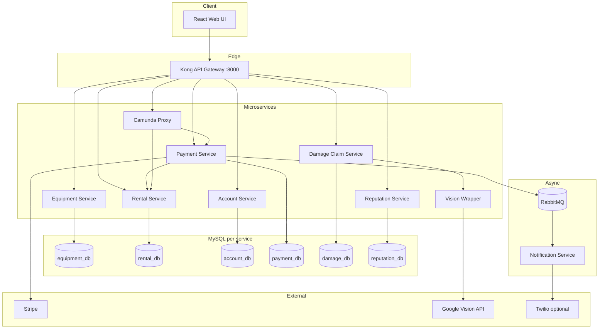
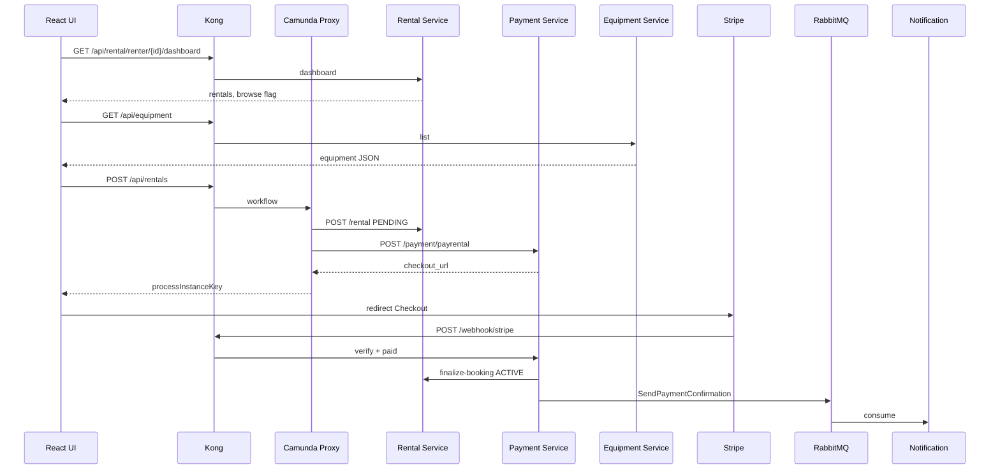
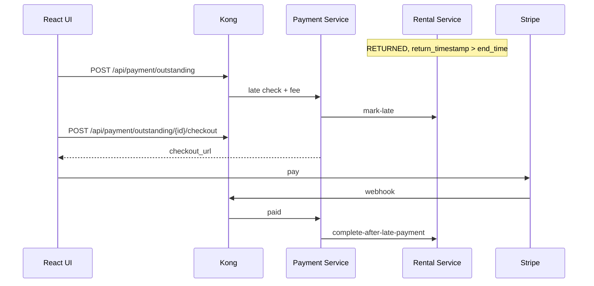
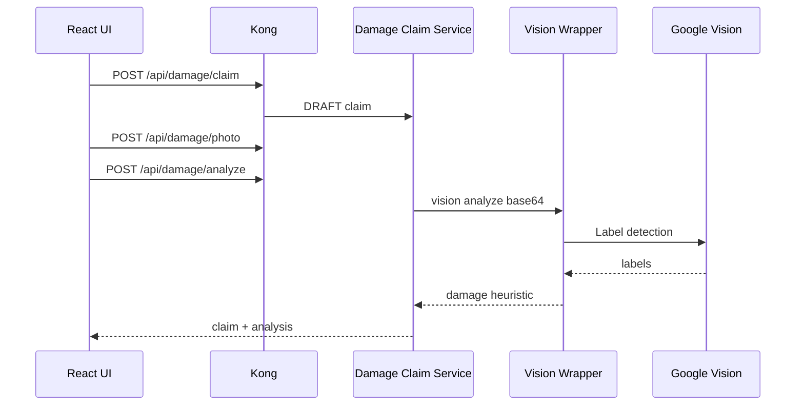
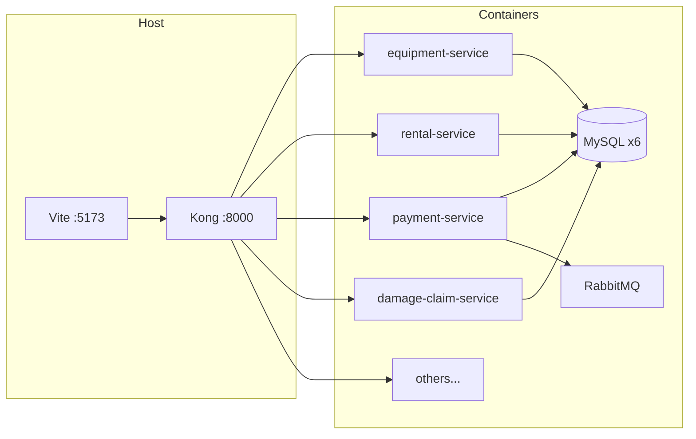

# All Diagrams (Mermaid) — Export to PNG/SVG

Paste into [mermaid.live](https://mermaid.live) or use VS Code Mermaid extension.

---

## A. SOA / logical architecture

---

## B. Scenario 1 — Rent + pay + lifecycle

---

## C. Scenario 2 — Late fee

---

## D. Scenario 3 — Damage + Vision

---

## E. Deployment (Docker Compose) — high level

