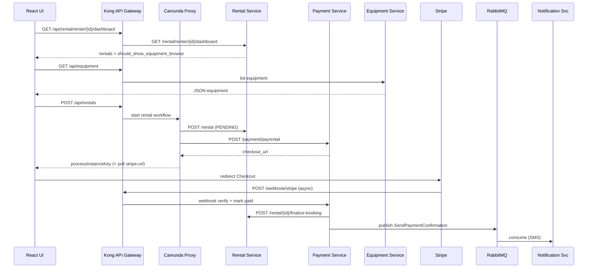
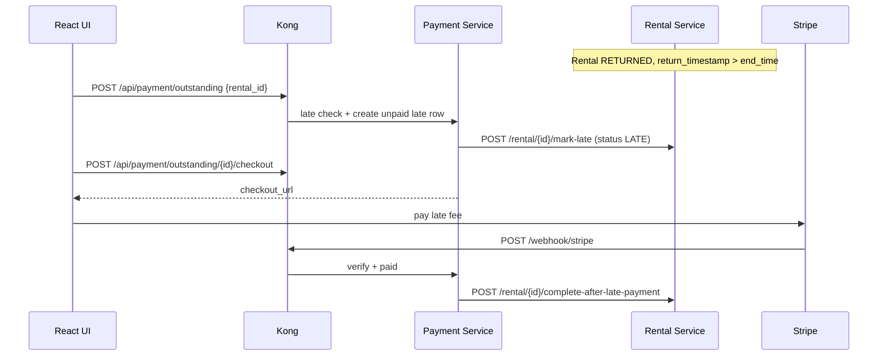
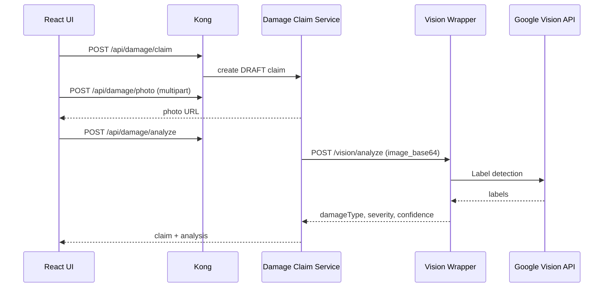
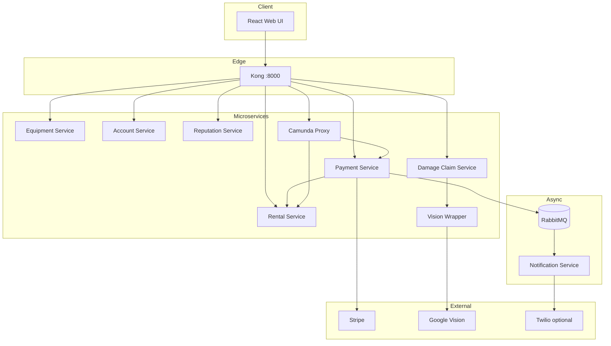

# IS213 Project Documentation Pack  
**Peer-to-Peer Equipment Rental Platform (G3-T2)**  
*Aligned with the current codebase (`frontend/` React + Vite, `backend/` Docker Compose microservices).*

**Full doc index:** [`README.md`](README.md). For **paste-ready report prose**, use **`IS213_Report_Main_Body_Draft.md`**; this file adds rubric mapping and matrices. Replace legacy wording (e.g. “OutSystems UI”) with **“React web UI”** unless you deploy OutSystems.

---

## 1. How this maps to IS213 minimum requirements

| Requirement | How your solution satisfies it | Where to point (evidence) |
|---------------|----------------------------------|---------------------------|
| **3 interesting user scenarios** | (1) Rent + pay + lifecycle, (2) Late return + late fee, (3) Damage claim + AI assessment | Sections 3–5 below; demo video |
| **≥3 atomic microservices, 3 data entities** | Equipment, Rental, Payment (+ Account, Damage, Reputation—additional entities) | `backend/*-service/`, each with own DB/schema |
| **≥1 service on OutSystems** | *If not using OutSystems:* state clearly in **Assumptions** that the **React UI** is the required web GUI; confirm with instructor whether a thin OutSystems shell is still required | Report § Assumptions |
| **One service reused across scenarios** | **Rental Service** (Scenario 1–3); **Payment Service** (1–2); **Account Service** (contact info); **Kong** (all HTTP) | Reuse matrix §2 |
| **External service** | **Stripe** (payments); **Google Cloud Vision** (damage labels); optional **Twilio** (SMS via notification consumer) | BTL §6 |
| **≥2 scenarios with orchestration/choreography** | **Orchestration:** `camunda-proxy` starts Camunda/Zeebe process + calls rental + payment. **Choreography:** Stripe webhook → Payment → Rental finalize; RabbitMQ → Notification | §3–4, diagrams |
| **Exclusive data store per microservice** | Separate MySQL DBs / volumes per service | `backend/compose.yaml` |
| **HTTP between services** | Inter-service calls (e.g. Payment → Rental; Damage → Vision) | `backend/payment-service/main.py`, etc. |
| **Message-based communication** | RabbitMQ topic (`rental_topic`), e.g. payment confirmation routing key | `backend/rental-service/messaging.py`, `payment-service/messaging.py` |
| **Web GUI + JSON** | React SPA; APIs return JSON | `frontend/`, Kong `/api/*` |
| **Docker + Docker Compose** | Full stack in `backend/compose.yaml` | README run instructions |
| **Beyond-the-labs (BTL)** | See §6—justify benefit to scenario | Dedicated slides + report subsection |

---

## 2. Microservice reuse matrix (for marks: “reuse across scenarios”)

| Microservice | Primary data entity | Scenario 1 | Scenario 2 | Scenario 3 |
|--------------|---------------------|------------|------------|------------|
| **Equipment Service** | Equipment / listing | Browse, availability | (availability after return) | Status if claim impacts listing |
| **Rental Service** | Rental booking | Create PENDING, finalize ACTIVE, lifecycle | RETURNED → **LATE** via payment-service path, complete | Rentals for claim linkage |
| **Payment Service** | Payment transaction | `POST /payment/payrental`, webhook → finalize | `POST /payment/outstanding` (**late check inside**), late checkout, webhook → complete | Extensible for penalties (same Stripe pattern) |
| **Account Service** | User account | Login, profile | Contact for notifications | Same |
| **Damage Claim Service** | Damage claim | — | — | Claim, photo, analyze |
| **Vision Wrapper** | — (stateless) | — | — | Label detection → damage heuristic |
| **Reputation Service** | Ratings / penalties | Reviews | Late penalty (if integrated) | — |
| **Notification Service** | — (consumer) | SMS on payment event | Same | Same |
| **Kong** | — gateway | All REST entry | All REST entry | All REST entry |
| **Camunda proxy** | — orchestrator adapter | Start workflow + create rental + call payment | *Optional* extended BPMN for return (your report should match what you actually demo) | *Optional* |

---

## 3. User Scenario 1 — Rent an item, pay, and complete lifecycle

### 3.1 One-sentence story
A renter browses equipment, creates a booking, pays through **Stripe Checkout**, the platform confirms payment via **webhook**, and the rental moves through pickup → return → reviews → completed.

### 3.2 Actors and data entities
**Actors:** Renter, Owner (implicit via equipment), Stripe, (optional) Twilio.  
**Entities:** Equipment, Rental, Payment, Account.

### 3.3 Steps (aligned with **actual** implementation)

1. **Dashboard / blocking rule** — UI calls `GET /api/rental/renter/{id}/dashboard`. If any rental is **PENDING** or **LATE**, browsing is blocked (marketplace gate).
2. **Browse equipment** — `GET /api/equipment` via Kong → Equipment Service.
3. **Start rental** — UI `POST /api/rentals` → **camunda-proxy**: creates **PENDING** rental in Rental Service, then calls **Payment Service** `POST /payment/payrental` (payment row **paying**, Stripe Checkout URL or mock URL).
4. **Pay** — Browser redirects to Stripe Hosted Checkout (or mock confirmation URL).
5. **Webhook** — Stripe `POST /webhook/stripe` (Kong) → **Payment Service** verifies signature, sets payment **paid**, calls Rental Service `POST /rental/{id}/finalize-booking` → **ACTIVE**, equipment **rented**.
6. **Choreography / async** — Payment Service publishes **SendPaymentConfirmation** to RabbitMQ → Notification Service (Twilio if configured).
7. **Lifecycle** — Dual confirmation flows: collect → return → reviews (`PUT` rental endpoints), ending in **COMPLETED** when both parties review.

### 3.4 Scenario diagram (Mermaid — paste into Word via draw.io / Mermaid Live, or export PNG)

### 3.5 BTL for Scenario 1 (pick 1–2 for the report; justify benefit)

| Topic | What to write | Why it counts as BTL |
|-------|----------------|----------------------|
| **Stripe webhook + signature verification** | Payment Service validates `stripe-signature` before marking paid and finalizing rental | Event-driven, async confirmation—not “UI says paid” |
| **Dedicated Payment microservice + DB** | Payment rows (`paying` / `paid`), isolated schema | Clear bounded context; audit trail |
| **Kong as single entry** | CORS + routing + webhook path | Production-style edge |

---

## 4. User Scenario 2 — Late return and late fee

### 4.1 One-sentence story
If the item is returned **after the scheduled end time**, the platform records a **late fee**, moves the rental to **LATE**, and the renter pays the fee through the same Stripe pattern; after payment, rental can move to **COMPLETED** per your rental rules.

### 4.2 Important alignment with **code** (update old report text)

- **Late vs due comparison** is implemented in **Payment Service** (`POST /api/payment/outstanding`): compares `return_timestamp` to `end_time`, computes fee ≈ **extra hours × hourly_rate**, then calls Rental Service `POST /rental/{id}/mark-late`.
- Do **not** claim full Camunda BPMN branching unless your demo shows it; the **implemented** path is **REST + Payment Service domain logic**.

### 4.3 Steps

1. Renter/owner complete return flow so rental is **RETURNED** with `return_timestamp` set (dual confirm return in Rental Service).
2. Back office or UI calls `POST /api/payment/outstanding` with `{ rental_id }` — Payment Service performs **late check**; if not late → 400; if late → insert **unpaid** late payment + **mark-late**.
3. UI calls `POST /api/payment/outstanding/{payment_id}/checkout` → Stripe session for late fee.
4. Webhook marks paid → `POST /rental/{id}/complete-after-late-payment` → **COMPLETED**.
5. RabbitMQ notification (same pattern as Scenario 1).

### 4.4 Diagram

### 4.5 BTL for Scenario 2

| Topic | Write-up hint |
|-------|----------------|
| **Domain logic in Payment Service** | Centralizes “is late?” + fee calculation—avoids duplicating rules in UI or orchestrator |
| **Idempotent / guarded transitions** | Rental Service rejects invalid state jumps—protects data integrity |

---

## 5. User Scenario 3 — Damage claim with AI assessment

### 5.1 Story
After a rental, the **owner** files a damage claim with a photo; **Damage Claim Service** stores the image, calls **Vision Wrapper** → **Google Vision API**; results are persisted for staff review.

### 5.2 Steps (code-aligned)

1. `POST /api/damage/claim` → claim in **DRAFT**.
2. `POST /api/damage/photo` — validate image type.
3. `POST /api/damage/analyze` — read file as **base64** to Vision Service (avoids unreachable image URLs for Google).
4. Staff resolve `POST /api/damage/{id}/resolve` (approve/reject) — if you demo this.

### 5.3 Diagram

### 5.4 BTL for Scenario 3

| Topic | Write-up hint |
|-------|----------------|
| **Google Cloud Vision** | External ML API; label-based heuristic for damage |
| **Base64 analysis path** | Addresses real constraint: Google cannot fetch private Docker URLs—shows engineering judgment |

---

## 6. Consolidated “Beyond the Labs” list (max impact for +3 marks)

Use **3–5 bullets total** in the main report; put details in appendix.

1. **Stripe Checkout + webhook signature verification** — asynchronous trust boundary.  
2. **API Gateway (Kong)** — centralized routing, CORS, webhook exposure.  
3. **RabbitMQ topic messaging** — decouple payment events from notification/Twilio.  
4. **Google Vision + dedicated wrapper service** — external AI integration with a clean HTTP contract.  
5. **Payment microservice with own DB** — rental payment + late fee as first-class records (not only UI state).  
6. **Docker Compose** — reproducible multi-DB, multi-service deployment for demo/grading.

*Optional (only if true in your demo):* Camunda Cloud Zeebe process start from `camunda-proxy`.

---

## 7. SOA / technical overview (Mermaid — appendix)

---

## 8. Simplifications & assumptions (honesty helps A+)

State briefly:

- **Single React SPA** fulfills the “web GUI” requirement; OutSystems is **not** in this repo unless you add it—clarify with faculty.
- **Camunda**: proxy attempts Zeebe start; if process fails, rental creation may still succeed—describe what you **guarantee in demo** (e.g. rental + Stripe URL always returned).
- **Notification**: consumer may log instead of sending SMS if Twilio keys absent—say “SMS when configured”.
- **Mock payment**: without `STRIPE_SECRET_KEY`, checkout URL may skip real Stripe—still document.

---

## 9. Appendix checklist (from IS213 PDF)

- [ ] Technical overview / SOA diagram(s) — §7 + service list in `backend/kong.yml`
- [ ] **API docs** — export OpenAPI from FastAPI (`/docs` per service) or maintain a table: base path, main routes, purpose
- [ ] **Team contribution table** — one row per member: services/features owned, integration, report sections, demo parts

---

## 10. Suggested 6-page report outline (main body)

1. **Introduction** — problem, sustainability angle, scope.  
2. **Architecture** — SOA, Kong, Docker, data isolation (short).  
3. **Scenario 1** — story + numbered steps + one diagram.  
4. **Scenario 2** — story + steps + diagram; **explicit sentence** that late logic is in Payment Service.  
5. **Scenario 3** — story + steps + diagram.  
6. **Beyond the labs** — ½ page, tied to scenarios.  
*(References if required by course—not counted in page limit if appendix.)*

---

*Generated to match repository layout as of project path `Rental213-1`. Update scenario numbers if your instructor template differs.*
